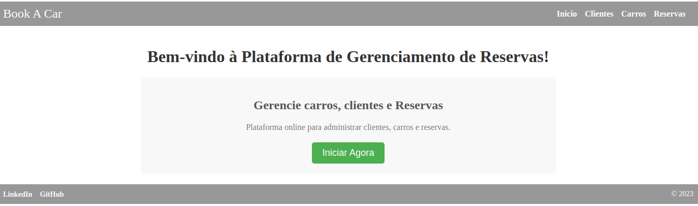
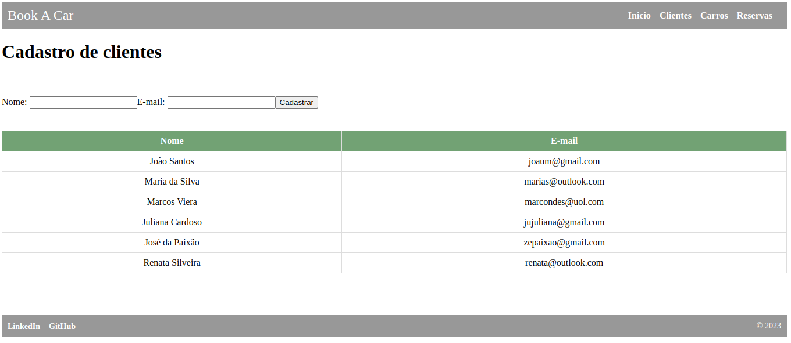
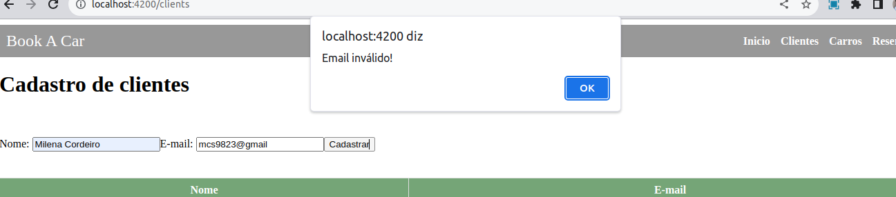
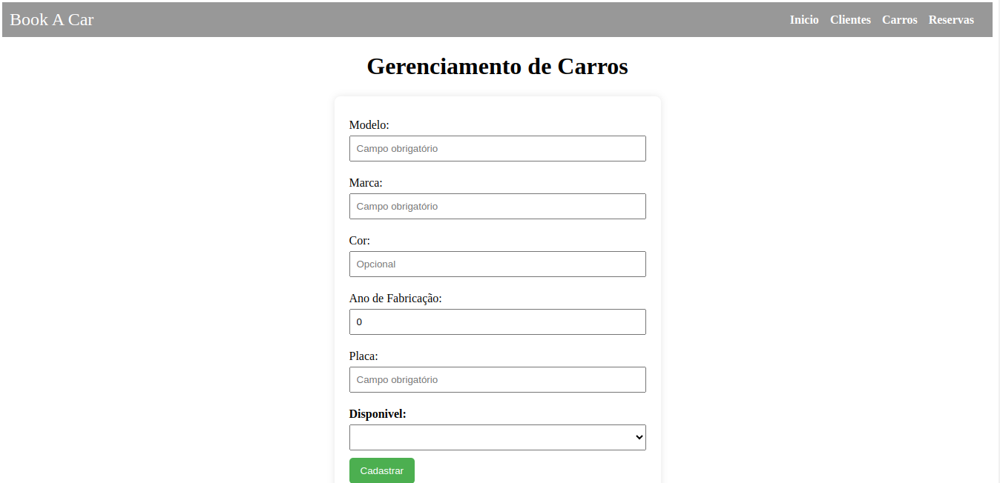
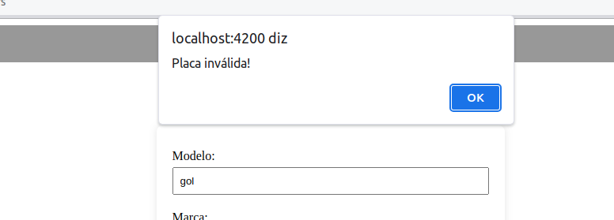
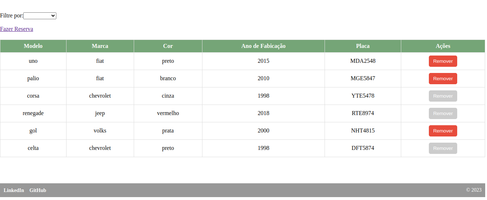
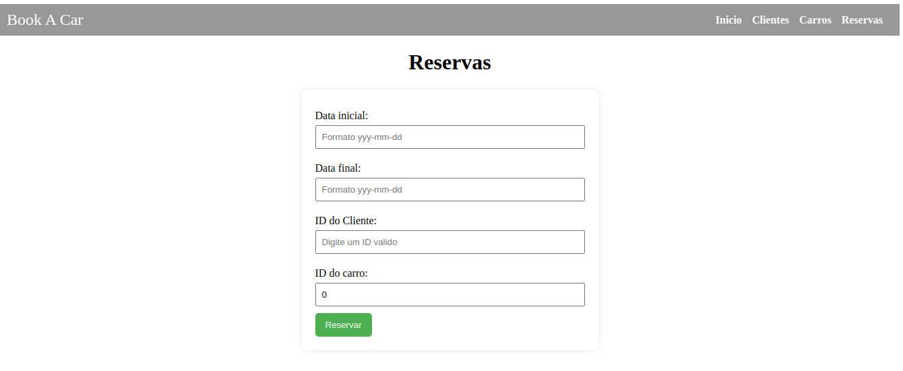
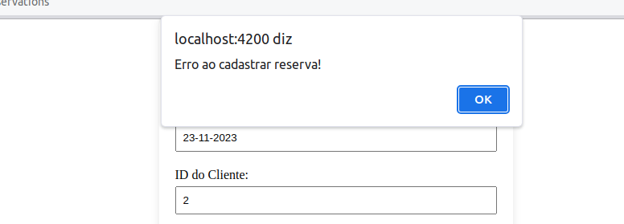
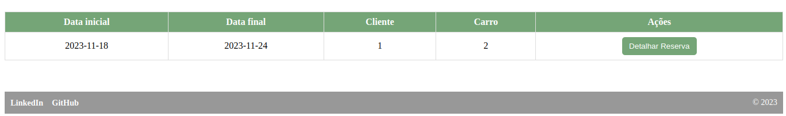

# Bem vindo a Book A Car

O projeto Book A Car é uma plataforma online de gestão de carros para reserva. Esse projeto foi desenvolvido para um BootCamp de Java spring e Angular.
A API que está integrada nessa aplicação você encontra [aqui](https://github.com/milena-cordeiro/BookACar).

Essa aplicação foi desenvolvida com Angular 15.

Esse projeto está em desenvolvimento, portando para utilizar é necessário clonar o repositório e seguir os passos abaixo.

## Rodando a aplicação localmente

Clone o projeto

```bash
  git clone https://github.com/milena-cordeiro/BookACar-front-end
```

Entre no diretório do projeto

```bash
  cd front-end
```

Instale as dependências

```bash
  npm install
```

Inicie o servidor
> A aplicação irá rodar no endereço http://localhost:4200

```bash
  npm run start
```

## Tela de Inicio

Essa é a tela de inicio da aplicação, onde o usuário pode navegar pelas páginas clicando nos links na navbar do header ou ser direcionado para a tela de gerenciamento de veiculos ao clicar no botão verde



## Tela de Cadastro de clientes

Na tela de cadastro de clientes é possivel cadastrar um novo cliente, e visualizar de imediato a lista de clientes cadastrados.
> Para cadastrar um cliente digite **nome** e **email** válidos, e clique no botão cadastrar.



> Caso um dos campos não esteja correto (email formato inválido), um alerta será exibido na tela.




## Tela de Gerenciamento de Veiculos

Na tela de gerenciamento de veiculos é possivel cadastrar um novo veiculo, e abaixo do formulario de cadastro é possivel ver a lista de veiculos cadastrados. 
> Para cadastro de veiculos é necessário preencher todos os campos obrigatórios, a placa deve ser no formato **LLLNNNN** e clicar no botão verde. 



> Caso um dos campos não esteja correto (placa formato inválido), um alerta será exibido na tela.



> A lista de cadastrados é atualizada automaticamente após o cadastro de um novo veiculo.



> Ao selecionar ao filtrar por disponiveis é possivel ver apenas os veiculos disponiveis para reserva.


## Tela de Gerenciamento de Reservas

Na tela de gerenciamento de reservas é possivel fazer o cadastro de reservas, e abaixo do formulario de cadastro é possivel ver a lista de reservas cadastradas.
> Para cadastro de reservas é necessário preencher todos os campos obrigatórios. No campo **data inicial** e **data final** é necessário digitar a data no formato **YYYY/MM/DD**.



>Caso o formato das datas esteja invalido, um alerta será exibido na tela.



> Após o cadastro de uma nova reserva, a lista de reservas é atualizada automaticamente.
E ainda é possivel detalhar cada reserva cadastrada, clicando no botão **Detalhar Reserva**. Para ocultar as informações da reserva, basta clicar novamente no mesmo botão.




#Melhorias Futuras

Há melhorias e implementações que podem ser feitas nessa aplicação, que devido ao tempo de entrega deste projeto não foram possíveis de serem realizadas. Porém serão feitas futuramente.
* Implementação de testes;
* implementação da funcionalidade de editar, excluir e cancelar reservas, bem como editar e excluir clientes;
* Implementação de um sistema de login e autenticação de usuários;
* Hosperdar a aplicação em um servidor para que seja possivel acessar de qualquer lugar;

E essas são algumas das implementações que pretendo fazer futuramente. Angular é um framework muito interessante e que permite a criação de aplicações incríveis e com muitas funcionalidades, que venho aprendendo a pouco tempo, então ainda estou descobrindo como algumas coisas funcionam, e conforme for adquirindo mais conhecimento, poderei aplicar nesse e em outros projetos tornando-os ainda melhores.


